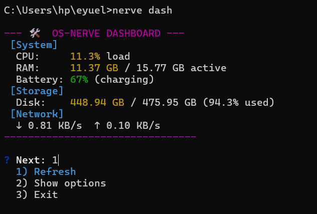
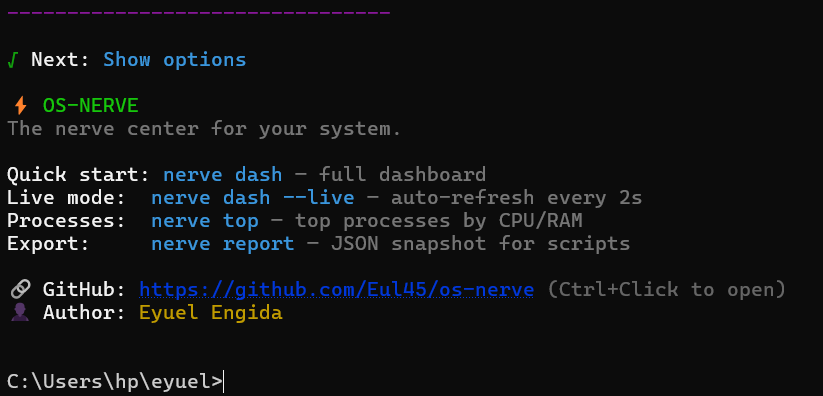

# ⚡ OS-NERVE

> The command-line nerve center for your system.

**OS-Nerve** is a lightweight terminal dashboard that monitors system vitals: CPU, RAM, disk, network, battery, and top processes. Use it for quick one-shot stats or a live-refreshing dashboard. Works on Windows, macOS, and Linux.

[](https://www.npmjs.com/package/os-nerve)
[](https://www.npmjs.com/package/os-nerve)
[](https://www.npmjs.com/package/os-nerve)

---

## ✨ Features

- **Dashboard** — CPU, RAM, disk, network, battery in one view
- **Live mode** — `nerve dash --live` refreshes every 2 seconds (Ctrl+C to exit)
- **Refresh & options** — After the dashboard: Refresh, Show options, or Exit
- **One-shot commands** — `nerve cpu`, `nerve mem`, `nerve net`, `nerve disk`, `nerve battery`
- **Top processes** — `nerve top` (top 10 by CPU; use `-n 20` for more)
- **Export** — `nerve report` or `nerve report --json` for scripts and automation

---

## 📦 Installation

```bash
npm install -g os-nerve
```

Requires **Node.js 18+**.

---

## 🖥️ Usage

| Command | Description |
|---------|-------------|
| `nerve` | Show welcome + help |
| `nerve dash` | One-shot dashboard (then: Refresh / Show options / Exit) |
| `nerve dash --live` | Live dashboard (refresh every 2s) |
| `nerve dash --live --interval 3` | Live, refresh every 3s |
| `nerve cpu` | CPU load only |
| `nerve mem` | Memory usage |
| `nerve net` | Network speed (default interface) |
| `nerve disk` | Disk usage (all mounts) |
| `nerve battery` | Battery level and state |
| `nerve top` | Top 10 processes by CPU |
| `nerve top -n 20` | Top 20 processes |
| `nerve report` | JSON snapshot (pretty) |
| `nerve report --json` | JSON snapshot (one line, for scripts) |

### Examples

```bash
# Quick system check
nerve dash

# Live monitoring
nerve dash --live

# Use in a script
nerve report --json | jq '.cpu.load'
```

---
| Dashboard | Options |
|-----------|---------|
|  |  |

## 👤 Author

**Eyuel Engida**
---

## 📄 License

MIT License
